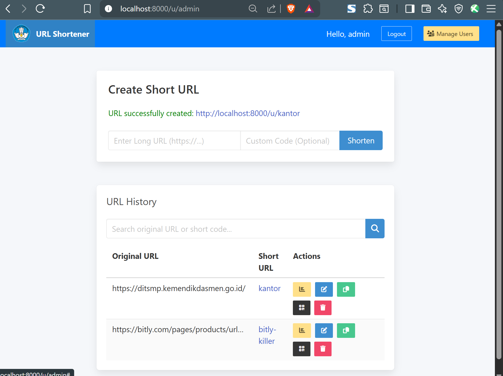
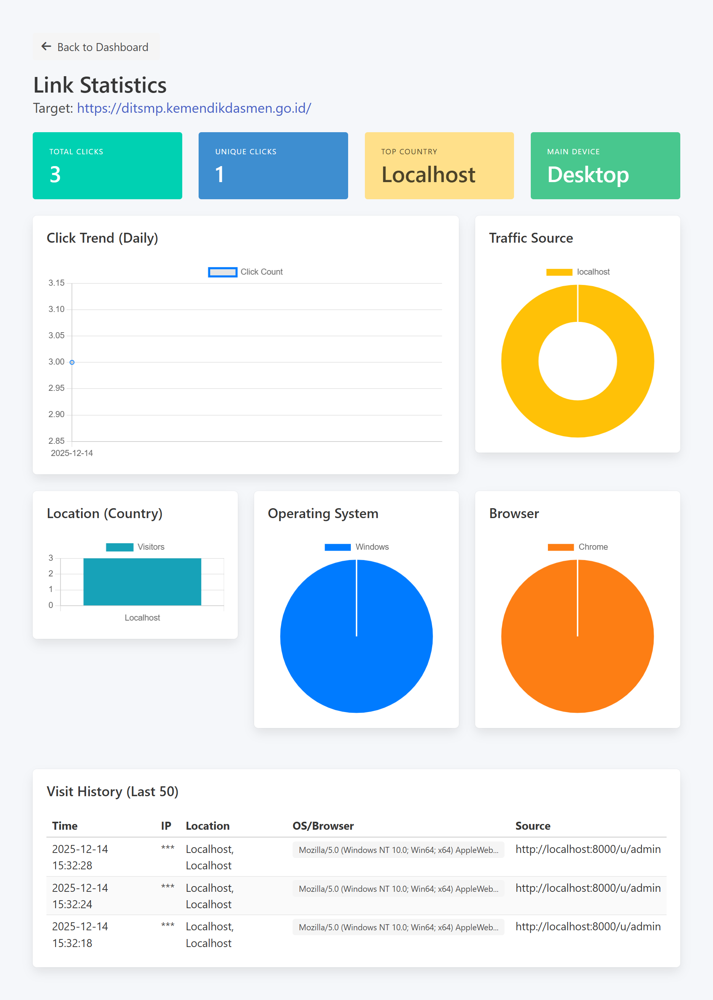

# 🔗 Simple PHP URL Shortener

<div align="center">


**Pemendek URL ringan, powerful, dan single-file yang ditulis dalam PHP.**  
Dirancang untuk kesederhanaan, kemudahan deployment, dan fungsionalitas yang robust tanpa framework yang berat.

[Fitur](#-fitur-utama) • [Demo](#-demo) • [Instalasi](#-instalasi--setup) • [Dokumentasi](DOCUMENTATION.id.md) • [Kontribusi](CONTRIBUTING.md)

*Read this in [English](README.md).*

</div>

---

## 📸 Demo

<div align="center">

### Tampilan Dashboard


### Setup Wizard


### Analytics & QR Code
<table>
  <tr>
    <td></td>
    <td></td>
  </tr>
</table>

</div>

---

## 🌟 Fitur Utama

### 🚀 **Mudah Di-Deploy**
- **Aplikasi Single File**: Semua dalam satu file `index.php`
- **Tanpa Dependency**: Tidak perlu composer, framework, hanya PHP
- **Konfigurasi Otomatis**: Setup wizard interaktif saat pertama kali dijalankan
- **Dynamic Path Handling**: Berfungsi di root domain atau subdirektori

### 📊 **Analytics Komprehensif**
- Lacak klik, pengunjung unik, dan lokasi geografis (Negara/Kota)
- Deteksi jenis perangkat, OS, dan browser
- Chart interaktif dengan Chart.js
- Pelacakan referrer dan analitik berbasis waktu

### 🗄️ **Fleksibilitas Database**
- **SQLite**: Tanpa konfigurasi, sempurna untuk situs kecil hingga menengah
- **MySQL**: Opsi production yang robust
- **PostgreSQL**: Performa tingkat enterprise
- Otomatis membuat index untuk performa query optimal

### 🎨 **Interface Modern**
- Desain bersih dan responsif dengan Bulma CSS
- Dashboard mobile-friendly
- Dukungan dark mode
- Bilingual: English & Indonesia

### 🔒 **Keamanan Utama**
- Proteksi CSRF pada semua form
- Password hashing dengan Bcrypt
- Session handling yang aman
- Validasi input dan pencegahan XSS

### ⚡ **Dioptimalkan untuk Performa**
- Database indexing built-in (query 10-100x lebih cepat)
- Summary statistik harian untuk situs high-volume
- Manajemen retensi data yang dapat dikonfigurasi
- Menangani jutaan kunjungan secara efisien

### 🎁 **Fitur Bonus**
- **Generasi QR Code**: QR code instan untuk semua short link
- **Manajemen User**: Dukungan multi-user dengan role-based access
- **Custom Short Code**: Gunakan kode Anda sendiri yang mudah diingat
- **Operasi Bulk**: Kelola banyak URL secara efisien

---

## 🆚 Mengapa Memilih Ini?

| Fitur | Proyek Ini | YOURLS | Polr | Shlink |
|---------|-------------|--------|------|--------|
| **Single File** | ✅ | ❌ | ❌ | ❌ |
| **Zero Config (SQLite)** | ✅ | ❌ | ❌ | ✅ |
| **Multi-Database** | ✅ (3 jenis) | ✅ (MySQL saja) | ✅ (MySQL saja) | ✅ (Multiple) |
| **Analytics Built-in** | ✅ Advanced | ✅ Basic | ✅ Basic | ✅ Advanced |
| **QR Code** | ✅ | ❌ | ❌ | ✅ |
| **Kompleksitas Setup** | 🟢 Mudah | 🟡 Sedang | 🟡 Sedang | 🟡 Sedang |
| **Dependencies** | Tidak ada | Banyak | Banyak | Banyak |
| **Ukuran File** | ~80KB | ~5MB | ~10MB | ~20MB |

**Sempurna untuk:**
- 🏠 Self-hoster yang menginginkan kesederhanaan
- 🚀 Deployment cepat tanpa setup kompleks
- 📱 Bisnis kecil hingga menengah
- 🎓 Proyek edukasi dan pembelajaran
- 💼 Manajemen link internal perusahaan

---

## 🚀 Instalasi & Setup

### Persyaratan
*   PHP 7.4 atau lebih tinggi
*   Ekstensi PDO (biasanya sudah termasuk)
*   Web Server (Apache/Nginx) dengan URL rewriting *(opsional tapi direkomendasikan)*
*   Database: MySQL 5.7+, PostgreSQL 9.5+, atau SQLite 3.x

### Quick Start (3 Langkah)

#### 1️⃣ **Download**
```bash
# Clone repository
git clone https://github.com/DodyBayuAp/url-shortener

# Rename directory sesuai dengan kebutuhan
mv url-shortener u
cd u

# Atau download dan extract file ZIP
```

#### 2️⃣ **Jalankan Setup Wizard**
Buka browser dan navigasi ke direktori instalasi:
```
http://localhost/u/
```

**Setup Wizard** akan memandu Anda:
- **Pilih Database**: SQLite (instan), MySQL, atau PostgreSQL
- **Konfigurasi**: Masukkan kredensial jika menggunakan MySQL/PostgreSQL
- **Install**: Klik "Simpan & Install" - selesai!

#### 3️⃣ **Login**
```
Username: admin
Password: admin
```
*Anda akan diminta mengubah password saat login pertama kali.*

---

### 🐳 Docker Deployment

#### Opsi 1: Menggunakan Docker Compose (Direkomendasikan)
```bash
docker-compose up -d
```

#### Opsi 2: Build dan Run Manual

**Linux/Mac:**
```bash
# Build image
docker build -t url-shortener .

# Jalankan container
docker run -d -p 8080:80 --name url-shortener \
  -v $(pwd)/data:/var/www/html/data \
  url-shortener
```

**Windows PowerShell:**
```powershell
# Build image
docker build -t url-shortener .

# Jalankan container
docker run -d -p 8080:80 --name url-shortener -v ${PWD}/data:/var/www/html/data url-shortener
```

Akses aplikasi di `http://localhost:8080`

Lihat [Panduan Docker](deploy/docker.md) untuk konfigurasi lanjutan.

---

### ⚡ PHP Built-in Server (Development)

```bash
cd url-shortener
php -S localhost:8000
```

Buka `http://localhost:8000` di browser Anda.

---

### 🌐 One-Click Deploy

[](https://heroku.com/deploy?template=https://github.com/yourusername/php-url-shortener)
[](https://railway.app/new/template?template=https://github.com/yourusername/php-url-shortener)

Lihat [Panduan Deployment](deploy/) untuk platform lainnya.

---

## 🔧 Konfigurasi Web Server

### Apache (.htaccess)
File `.htaccess` yang disertakan menangani URL rewriting secara otomatis:
```apache
RewriteEngine On
RewriteCond %{REQUEST_FILENAME} !-f
RewriteCond %{REQUEST_FILENAME} !-d
RewriteRule ^(.*)$ index.php [QSA,L]
```

### Nginx
Tambahkan ini ke server block Anda:
```nginx
location / {
    try_files $uri $uri/ /index.php?$query_string;
}
```

Lihat [nginx.conf.example](nginx.conf.example) untuk konfigurasi lengkap.

---

## 📖 Dokumentasi

- **[Dokumentasi Teknis](DOCUMENTATION.id.md)** - Skema database, arsitektur, kustomisasi
- **[Panduan Kontribusi](CONTRIBUTING.md)** - Cara berkontribusi ke proyek ini
- **[Changelog](CHANGELOG.md)** - Riwayat versi dan update
- **[Panduan Deployment](deploy/)** - Instruksi deployment spesifik platform

---

## 🤝 Kontribusi

Kami menerima kontribusi! Baik itu:
- 🐛 Laporan bug
- 💡 Saran fitur
- 📝 Perbaikan dokumentasi
- 🔧 Kontribusi kode

Silakan baca [Panduan Kontribusi](CONTRIBUTING.md) untuk memulai.

---

## 📄 Lisensi

Proyek ini dilisensikan di bawah **MIT License** - lihat file [LICENSE](LICENSE) untuk detail.

**TL;DR**: Bebas digunakan, dimodifikasi, dan didistribusikan untuk proyek personal atau komersial.

---

## ⭐ Tunjukkan Dukungan Anda

Jika Anda merasa proyek ini bermanfaat, pertimbangkan untuk:
- ⭐ **Beri bintang repository ini** untuk menunjukkan dukungan Anda
- 🐦 Bagikan di media sosial
- 🔗 Gunakan dalam proyek Anda
- 🤝 Berkontribusi perbaikan

**Setiap bintang memotivasi kami untuk terus berkembang!** 🚀

---

## 🙏 Acknowledgments

- Dibuat dengan ❤️ menggunakan native PHP
- UI powered by [Bulma CSS](https://bulma.io/)
- Chart oleh [Chart.js](https://www.chartjs.org/)
- QR Code oleh [QRCode.js](https://davidshimjs.github.io/qrcodejs/)
- Geolocation oleh [IP-API](https://ip-api.com/)

---

<div align="center">

**Dibuat dengan ❤️ untuk komunitas open-source**

[⬆ Kembali ke Atas](#-simple-php-url-shortener)

</div>
